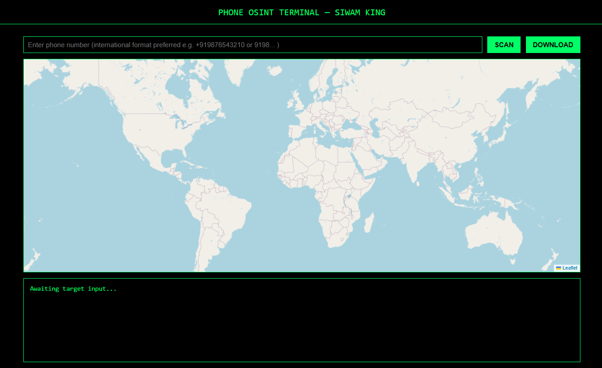

# Phone OSINT Terminal — Radar Tracker

<p align="center">
  
</p>
<p align="center">
  <span style="color:#00ff66;font-family:monospace;font-size:1.15rem;background:#111;padding:6px 18px;border-radius:8px;box-shadow:0 2px 12px rgba(0,255,102,0.07);">
    Built by SIWAM KING — Caffeinated Code, Crafted for OSINT Hunters
  </span>
</p>

**[🔗 Live Demo](https://siwam-king1.github.io/num-osint/)**

**num-osint** is a hacker-style phone number OSINT tool for reverse phone lookup, real-time phone location tracking, and carrier identification. Visualize results with animated radar mapping. Perfect for investigators, researchers, and cybersecurity professionals.

> **For research and educational use only.**

---

## Features

- **Hacker Terminal Aesthetic:** Green-on-black, typing animation, and radar-style map interface.
- **Carrier & Country Lookup:** Uses [NumVerify](https://numverify.com/) API to fetch details.
- **Location Geocoding:** Resolves locations via OpenStreetMap’s Nominatim service.
- **Radar Animation:** Full-map sweep, country zoom, and marker ping for visual feedback.
- **Downloadable Log:** Save your search session as a `.txt` file.
- **Responsive:** Works on both desktop and mobile devices.
- **Built-in How-To Guide:** Accessible usage instructions for new users.

---

## How to Use

1. **Enter Phone Number:**  
   Input the phone number in international format (e.g., `+15551234567` or `447911123456`).

2. **Click `SCAN`:**  
   - Radar sweeps the map.
   - Country is identified and centered.
   - If the region/state/city is available, radar zooms and marks it.

3. **Click `DOWNLOAD`:**  
   - Save a text log of your search results.

4. **Need Help?**  
   - Click `[+] How to Use` for a quick step-by-step guide.

---

## API Key Setup

This tool requires a **NumVerify API key** for phone lookups.

### How to Get Your API Key

1. Go to [https://numverify.com/](https://numverify.com/)
2. Sign up for a free account.
3. After verifying your email, access your dashboard to find your API key.
4. In `index.html`, replace the placeholder key in this line:
   ```js
   const APILAYER_KEY = "YOUR_OWN_NUMVERIFY_API_KEY";
   ```
5. Save and reload the page in your browser.

---

## Dependencies

- [NumVerify](https://numverify.com/) (by APILayer) — phone number validation and lookup.
- [OpenStreetMap Nominatim](https://nominatim.openstreetmap.org/) — geocoding.
- [Leaflet.js](https://leafletjs.com/) — interactive mapping.
- No backend/server required; everything runs in the browser.

---

## Privacy & Legal Notice

- **No lookup data is stored or logged by this tool itself.**
- **All lookups are client-side and use public third-party APIs.**
- **Intended for lawful, ethical, and educational OSINT research only.**

---

## Local Setup

1. **Clone or Download** this repository.
2. **Set your NumVerify API key** in `index.html` as described above.
3. **Open `index.html`** in your browser.

No other setup or installation is needed.

---

## Credits

- **NumVerify** (APILayer) — phone number validation API.
- **Leaflet.js** — mapping engine.
- **OpenStreetMap Nominatim** — geocoding.
- **UI/Logic:** [SIWAM KING](https://github.com/siwam-king1)

---

## License

MIT License.  
© 2025 SIWAM KING

---
